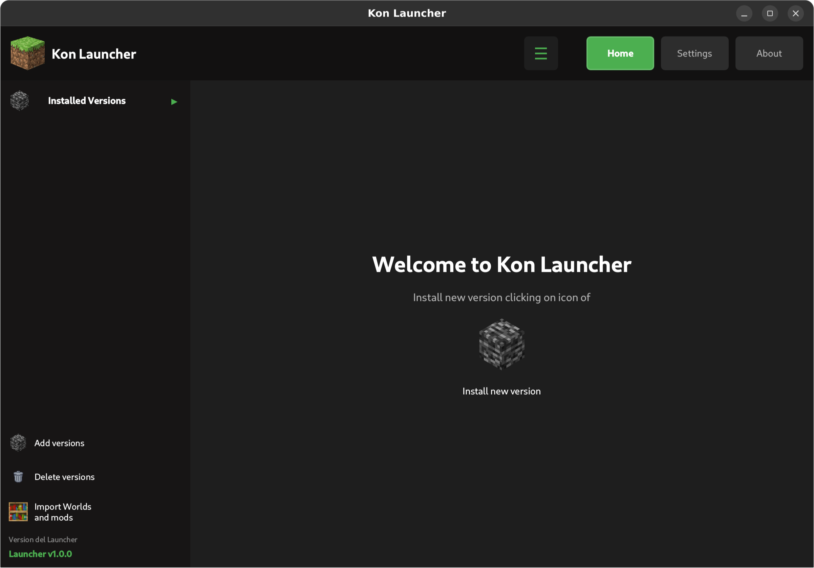
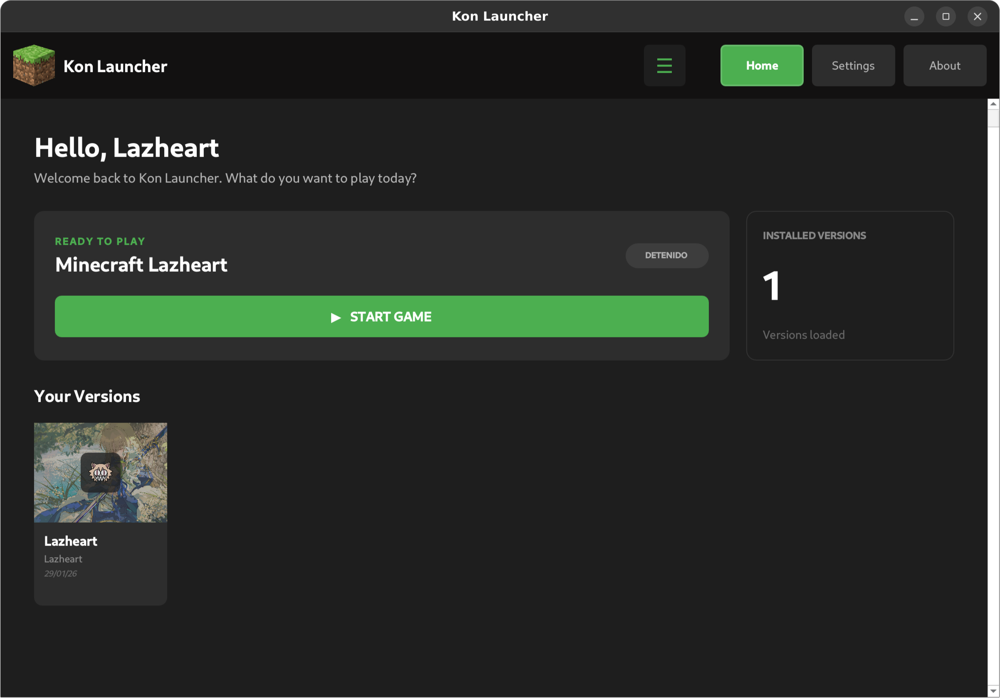
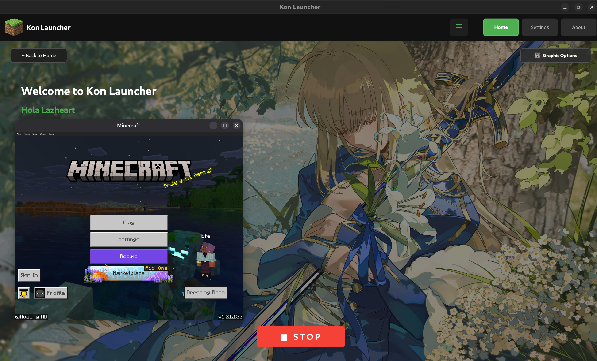

# Minecraft Bedrock Launcher (UI Flatpak)

Launcher no oficial para Minecraft Bedrock Edition en Linux, con interfaz gráfica basada en Qt.

## Capturas de pantalla

Estas imágenes están dentro del repositorio para que puedas obtener sus URLs públicas (raw) en GitHub:

- 
- 
- 

Cuando subas el proyecto a GitHub:

1. Abre cada imagen en GitHub (`flatpak/screenshoots/pruebasX.png`).
2. Haz clic en **View raw** (Ver raw).
3. Copia la URL del navegador (será algo como `https://raw.githubusercontent.com/USER/REPO/BRANCH/flatpak/screenshoots/pruebas1.png`).
4. Pega esa URL en el archivo de metainfo Flatpak `flatpak/org.lazheart.minecraft-launcher.metainfo.xml`, reemplazando las rutas actuales de las capturas dentro de `<screenshots>`:

```xml
<screenshots>
  <screenshot type="default">
    <image>URL_RAW_DE_pruebas1.png</image>
  </screenshot>
  <screenshot>
    <image>URL_RAW_DE_pruebas2.png</image>
  </screenshot>
  <screenshot>
    <image>URL_RAW_DE_pruebas3.png</image>
  </screenshot>
</screenshots>
```

De esa forma, Flathub y otros visores podrán mostrar las capturas usando las URLs públicas de GitHub.
